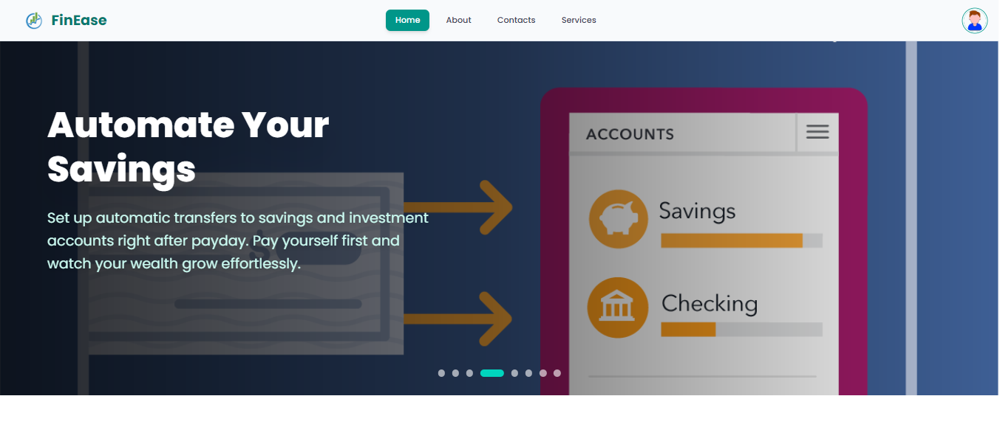
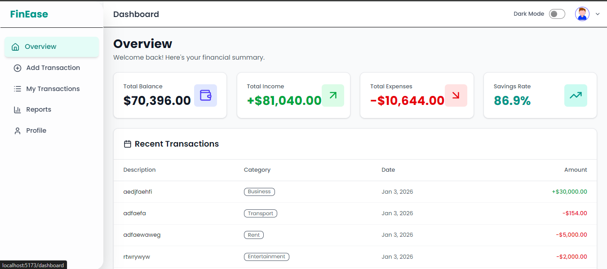
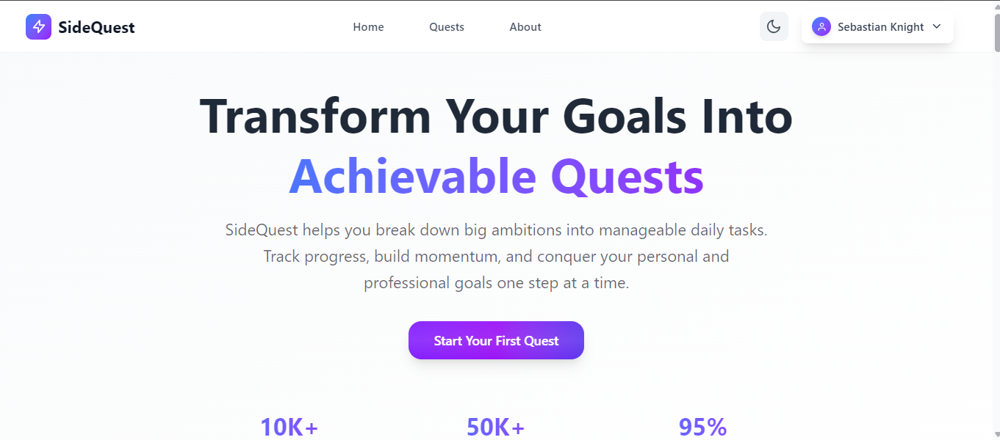

<!-- Banner -->

  

---

## 👋 Hi, I'm Pritom Das  
**Junior Full-Stack Developer (MERN | Next.js)**  

I build **real-world web applications** with a strong focus on usability, clean UI, and scalable backend logic.  
I enjoy turning ideas into products people can actually use — from service booking platforms to dashboard-driven systems.

I'm actively seeking **Junior / Entry-Level Full-Stack or React Developer roles**, where I can learn from experienced engineers and contribute to meaningful products.

---

## 🚀 What I'm Currently Working On
- 🔭 Building a **care service booking platform** using **Next.js & NextAuth**
- 🌱 Deepening my understanding of **full-stack architecture**
- 🎨 Improving **UI/UX, accessibility, and performance**
- 🛒 Planning a **modern e-commerce platform**
- 🎯 Long-term goal: Become a **confident full-stack engineer** and future tech lead

---

## 🧠 Tech Stack & Tools

### Frontend
- React.js  
- Next.js (App Router)  
- Tailwind CSS  
- JavaScript (ES6+)  

### Backend & Authentication
- Node.js  
- Express.js  
- MongoDB  
- NextAuth.js  
- Firebase Authentication  

### Data & State Management
- TanStack Query (React Query)

### Tools & Workflow
- Git & GitHub  
- REST APIs  
- Vercel & Netlify Deployment  

  

---

# Featured Projects

A collection of full-stack web applications showcasing skills in modern web development, including authentication, database management, responsive design, and role-based functionality.

## 🩺 Care.xyz — Care Service Booking Platform

### Project Overview
Care.xyz is a real-world care service booking platform that connects families with verified caregivers. Users can book in-home services for children, elderly individuals, and general home care, manage bookings, and track service history with an emphasis on trust, safety, and compassion.

### Live Demo
[https://carexyz-ten.vercel.app/](https://carexyz-ten.vercel.app/)

### Technologies Used
- Next.js
- NextAuth.js
- MongoDB
- Tailwind CSS

### Core Features
- Secure user authentication with protected routes
- Service browsing and booking system (child care, elderly care, home care)
- Booking management and service history tracking
- Role-based access and logic
- Responsive, SEO-friendly user interface
- Testimonials and caregiver statistics for building trust

### Dependencies Used
Key dependencies: `next`, `react`, `next-auth`, `mongoose`, `tailwindcss` (refer to `package.json` for complete list).

### How to Run Locally
1. Clone the repository: `git clone <repository-url>` 
2. Navigate to the project directory: `cd carexyz` 
3. Install dependencies: `npm install` 
4. Set up environment variables (e.g., MongoDB URI, NextAuth secrets) in `.env.local` 
5. Run the development server: `npm run dev` 
6. Open [http://localhost:3000](http://localhost:3000)

---

## 💳 LoanLink — Loan Management System

.png)
.png)

### Project Overview
LoanLink is a full-stack MERN application that streamlines loan applications, approvals, repayments, and administrative operations with specialized dashboards for borrowers, managers, and admins.

### Live Demo
[https://loanlinkph.netlify.app/](https://loanlinkph.netlify.app/)

### Technologies Used
- React
- Node.js
- Express.js
- MongoDB
- TanStack Query

### Core Features
- Role-based dashboards (Borrower, Manager, Admin)
- Loan application submission and approval workflow
- Secure authentication
- Real-time data fetching with caching
- Administrative tools for loan oversight

### Dependencies Used
Key dependencies: `react`, `@tanstack/react-query`, `express`, `mongoose`, JWT for authentication (refer to `package.json`).

### How to Run Locally
1. Clone the repository: `git clone <repository-url>` 
2. Install dependencies in both client and server folders: `npm install` 
3. Set up environment variables (e.g., MongoDB URI, JWT secret) in `.env` files
4. Start the backend: `npm start` (server folder)
5. Start the frontend: `npm start` (client folder)
6. Access the app at [http://localhost:3000](http://localhost:3000)

---

## 📊 FinEase – Personal Finance Manager with Dashboard

### Project Overview
FinEase is a full-stack personal finance management application designed to help users take control of their money effortlessly. Users can log incomes and expenses, categorize transactions, and visualize their financial habits with intuitive dashboards. The newly added **dashboard** provides interactive charts, summaries, and insights, making it easier to track spending patterns, savings, and overall financial health at a glance.

With FinEase, users can:
- Easily monitor daily, weekly, and monthly expenses
- Gain actionable insights through visual analytics
- Make informed decisions to save and budget effectively

### Live Demo
[https://boisterous-pavlova-194228.netlify.app/](https://boisterous-pavlova-194228.netlify.app/)

### Technologies Used
- Frontend: React, Chart.js, Tailwind CSS
- Backend: Node.js, Express.js
- Database: MongoDB
- Authentication: Firebase Authentication

### Core Features
- Add, edit, and delete income/expense transactions
- Categorize transactions for detailed analysis
- Secure user authentication and profile management
- Interactive dashboards with spending charts, summaries, and insights
- RESTful backend API for data management

### Dependencies Used
Key dependencies: `react`, `firebase`, `express`, `mongodb`, `chart.js` (for analytics), and others as per `package.json`.

### How to Run Locally
1. Clone the repository: `git clone <repository-url>` 
2. Install dependencies in client and server folders: `npm install` 
3. Configure Firebase and MongoDB in environment variables
4. Start backend: `npm start` (server)
5. Start frontend: `npm start` (client)
6. Visit [http://localhost:3000](http://localhost:3000)

---

## 🎮 SideQuest — Gamified Learning Platform

### Project Overview
SideQuest is an innovative gamified learning platform that transforms education into an engaging quest-based experience. Users can create, complete, and share learning quests while earning XP points, building streaks, and tracking their progress through a modern, interactive interface.

### Live Demo
[https://sidequest-next.vercel.app/](https://sidequest-next.vercel.app/)

### Technologies Used
- Next.js 16 (App Router)
- NextAuth.js
- MongoDB
- Tailwind CSS
- Framer Motion
- React Hot Toast

### Core Features
- **Quest Creation System** - Users can design and publish custom learning quests
- **Gamification Elements** - XP points, achievement badges, and progress tracking
- **User Authentication** - Secure login/signup with JWT sessions and protected routes
- **Dashboard Analytics** - Track learning progress, streaks, and achievements
- **Modern UI/UX** - Smooth animations, responsive design, and intuitive navigation
- **Profile Management** - User profiles with statistics and settings
- **Quest Categories** - Organized quests by difficulty and subject areas

### Dependencies Used
Key dependencies: `next`, `react`, `next-auth`, `mongoose`, `tailwindcss`, `framer-motion`, `react-hot-toast` (refer to `package.json` for complete list).

### How to Run Locally
1. Clone the repository: `git clone <repository-url>` 
2. Navigate to the project directory: `cd sidequest-next` 
3. Install dependencies: `npm install` 
4. Set up environment variables (e.g., MongoDB URI, NextAuth secrets) in `.env.local` 
5. Run the development server: `npm run dev` 
6. Open [http://localhost:3000](http://localhost:3000)

---

## 🔗 Connect With Me
- 💼 **LinkedIn:** www.linkedin.com/in/pritom1722002
- 🌐 **GitHub:** https://github.com/Pritom678
- 🌍 **Portfolio:** https://portfoliopritom.netlify.app/

---

## 📊 GitHub Activity

  
  

  

