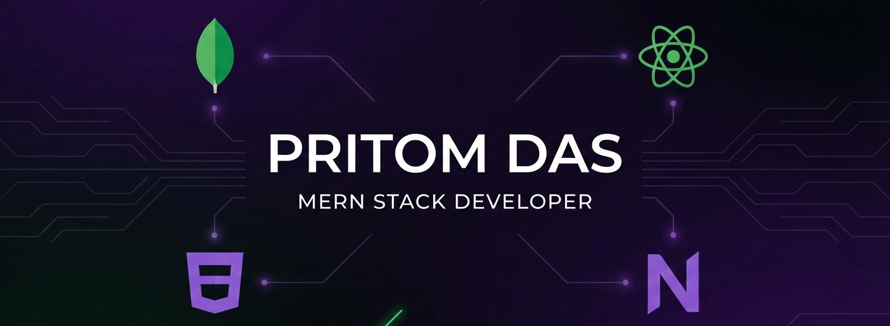

<!-- Banner -->

 

<!-- Animated Typing Header -->

---

### 👨‍💻 About Me

Full-stack developer focused on building scalable, real-world applications  
with clean UI, secure authentication, and dashboard architecture.

- 🚀 Passionate about production-ready systems  
- 🔐 Love building authentication flows  
- 📊 Interested in scalable backend design  
- 🎯 Goal: Become a strong full-stack engineer  

---

### ⚙️ Tech Stack

---

### 🧠 Core Expertise

- Authentication & Authorization (JWT / NextAuth)
- Role-Based Dashboard Systems
- REST API Architecture
- Full-Stack Deployment (Vercel / Netlify)
- UI/UX Focused Frontend Development

---

# 🚀 Projects

---

## 🎧 AudioPulse  
**Premium Audio E-Commerce Platform**

Stack: `Next.js` `TypeScript` `Node.js` `MongoDB` `JWT` `Cloudinary`

- Admin dashboard with full product CRUD  
- Secure authentication system  
- Dynamic cart with real-time updates  

🔗 Live: (add link)  
🔗 Code: (add repo)

---

## 🩺 Care.xyz  
**Care Service Booking Platform**

Stack: `Next.js` `NextAuth` `MongoDB` `Tailwind`

- Secure booking system  
- Protected routes  
- Role-based access logic  

🔗 Live: https://carexyz-ten.vercel.app/

---

## 💳 LoanLink  
**Loan Management Dashboard**

Stack: `React` `Node.js` `Express` `MongoDB`

- Multi-role dashboards  
- Loan approval workflow  
- Secure backend API  

🔗 Live: https://loanlinkph.netlify.app/

---

### 📈 Activity

---

 

## 🌐 Connect With Me

  <a href="https://www.linkedin.com/in/pritom1722002">LinkedIn</a> •
  <a href="https://github.com/Pritom678">GitHub</a> •
  <a href="https://portfoliopritom.netlify.app/">Portfolio</a>

