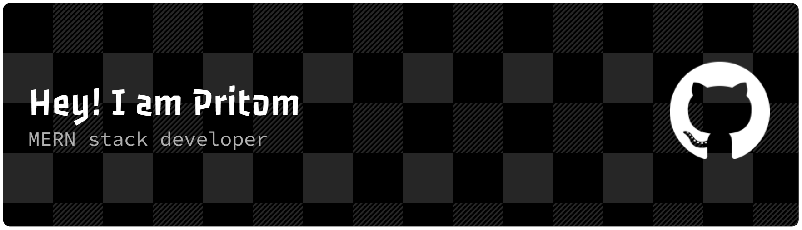
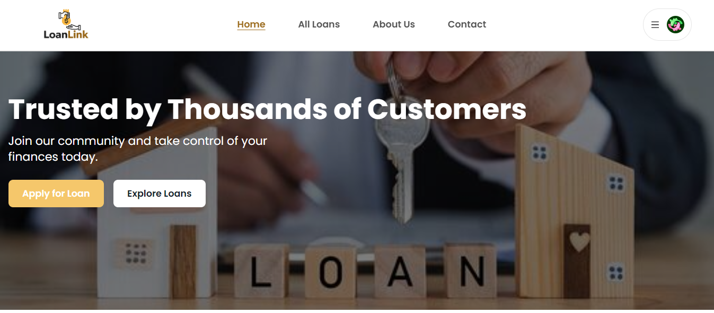
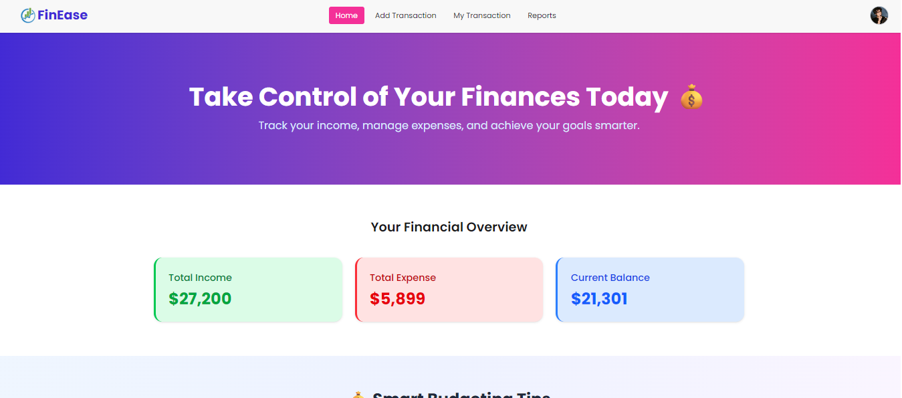
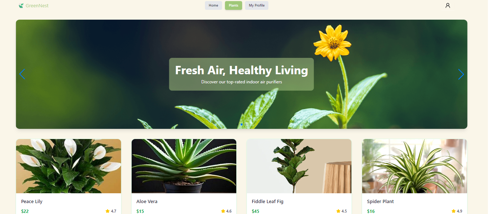

<!-- Banner -->

  

---

## 👨‍💻 About Me  
I’m a developer who enjoys building products people can actually use.  
Most of the time I'm calm, but also a bit impatient when ideas excite me.  
I’m passionate about creating clean UI experiences and slowly growing into a full-stack expert.  
My long-term goal is to become a tech lead and build impactful web applications.

---

## 🚀 Current Activities  
- 🔭 Currently building a **care service booking website**  
- 🌱 Learning **full website development**  
- ✔️ Improving my **UI design** and **problem-solving**  
- 📦 Planning to build an **e-commerce website**  
- 🎯 Working toward becoming a **full-stack expert**

---

## 🛠️ Skills  

  <!-- HTML -->
  
  <!-- CSS -->
  
  <!-- Tailwind -->
  
  <!-- JavaScript -->
  
  <!-- React -->
  
  <!-- Node -->
  
  <!-- MongoDB -->
  
  <!-- Firebase -->
  
  <!-- Tanstack (represented by React Query) -->
  
  <!-- Next.js -->
  
  <!-- NextAuth.js -->
  

---

## 🔗 Social Links  
- 🌐 **GitHub:** https://github.com/Pritom678  
- 💼 **LinkedIn:** https://www.linkedin.com/in/pritom-das-985846319/
- 🌍 **Portfolio:**  

---

## 📊 GitHub Stats  

  
  

  

---

## 💻 Projects

| Project | Description | Features | Live Demo |
|---------|-------------|----------|-----------|
| **LoanLink – Loan Management Platform**    | A full-stack loan management platform built with the **MERN stack**. Supports borrower applications and manager loan publishing with a modern, scalable architecture using **TanStack Query** and **React Router Form**. | - Role-based dashboards (Borrower, Manager & Admin)   - Loan application & approval workflow   - Secure authentication   - Real-time data fetching with TanStack Query   - Form handling with React Router Form | [View Live](https://loanlinkph.netlify.app/) |
| **Personal Finance Manager**    | A web app to manage personal finances, built with **React and Firebase**. Helps users track income and expenses and analyze spending habits. | - Add income and expenses   - Categorize transactions   - View analytics and charts   - User authentication | [View Live](https://boisterous-pavlova-194228.netlify.app/) |
| **GreenNest Store**    | An e-commerce website for plants, built using **React and Firebase**. Users can browse products, add to cart, and manage accounts. | - Product listings and categories   - Cart and checkout   - User accounts/login   - Responsive design | [View Live](https://green-nest-project-8ed1a.web.app/) |
| **Care.xyz – Care Service Booking Website**    | A care service platform built with **Next.js and NextAuth.js**. Users can book caretaking services for **children, elderly, and home care**, manage bookings, and track service history. | - User authentication with NextAuth.js   - Booking for children, elderly, and home care services   - Responsive UI with Tailwind CSS   - Server-side rendering with Next.js   - Manage and track bookings efficiently | [View Live](https://carexyz-ten.vercel.app/) |
